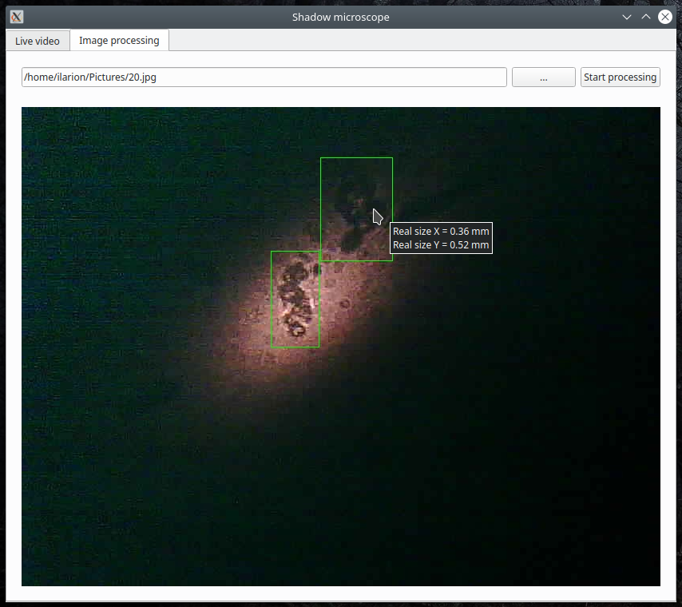

# Shadow Microscope

Проект позволяет исследовать жидкость на наличие микроскопических механических частиц и рассчитать их реальные размеры.

	

Составляющие моего проекта:

- теневой микроскоп на основе лазера и камеры;
- программа, которая позволяет обрабатывать полученные снимки.

## Устройство теневого микроскопа

На схеме показано как работает увеличение микроскопа на основе лазера:

	

Лучи лазера преломляются при выходе из капли таким образом, что на экране мы видим увеличенные теневые проекции микрообъектов, которые находятся внутри капли. Капля жидкости выступает в роли линзы.

Я использовал обычную проточную воду. Получились подобные изображения:

	

Скорее всего это микрокусочки пыли, грязи.

Возле лазера установлена камера, которая передаёт видеопоток в реальном времени на компьютер.

## Программа для обработки изображений

В первой вкладке программы отображается видеопоток с камеры. Во второй вкладке можно обработать изображение нейронной сетью и рассчитать реальные размеры микрообъектов:

	

